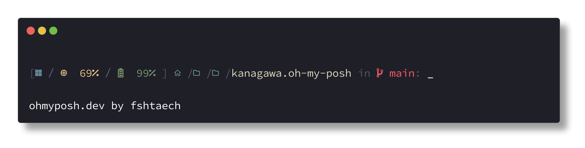
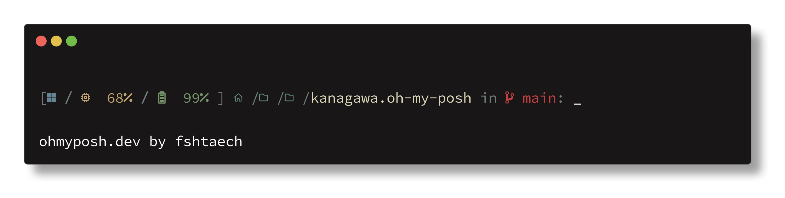

# kanagawa.oh-my-posh
A custom theme for oh-my-posh with the [kanagawa](https://github.com/rebelot/kanagawa.nvim?tab=readme-ov-file) color palette. Supports Kanagawa Wave and Kanagawa Dragon.

# Terminal Settings
- Font: SauceCode Pro Nerd Font Mono
- Font Size: 11
- Line Height: 1.2
- Color Scheme: Kanagawa Wave/Dragon
- Niceties: Terminal-Icons

# Previews
###  Kanagawa Wave
Default

Slim

### Kanagawa Dragon
Default

Slim
